# Examples

Some examples of working with the `chirper.io` API.

### User Registration

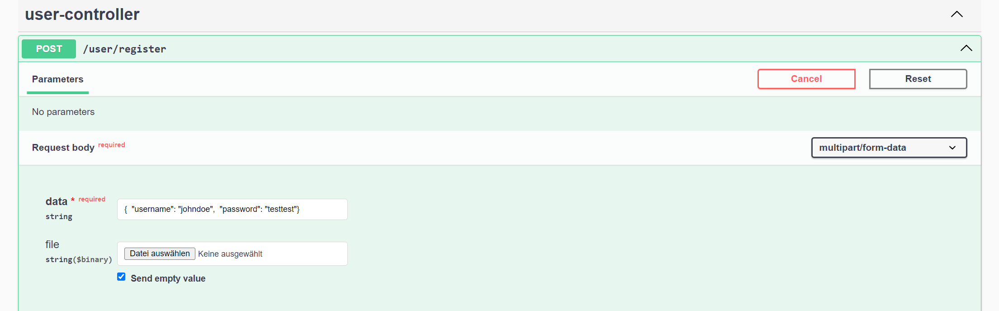

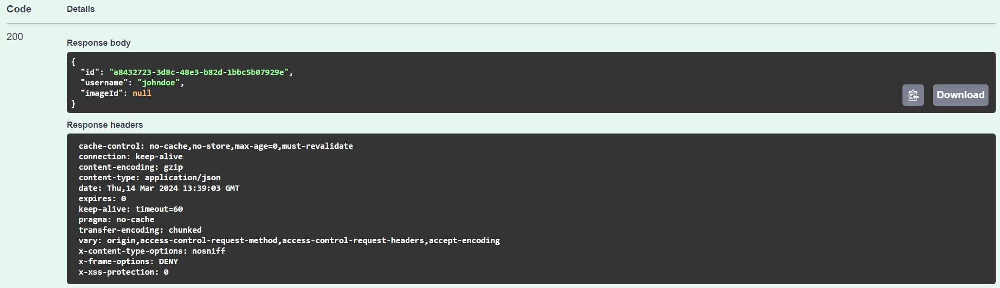

### Chirp Feed

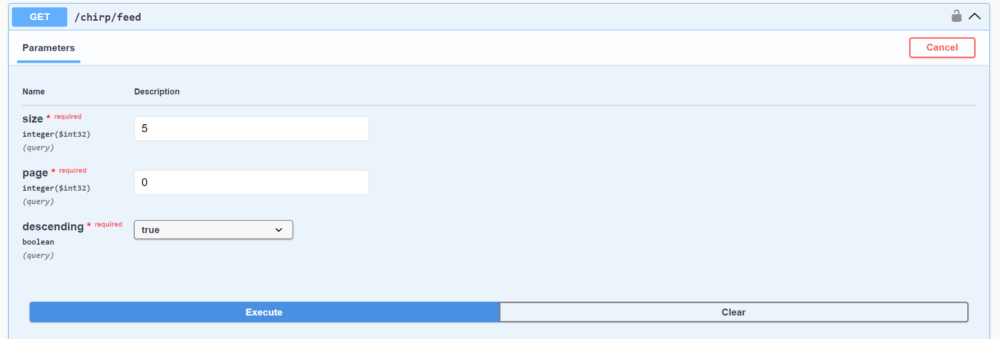

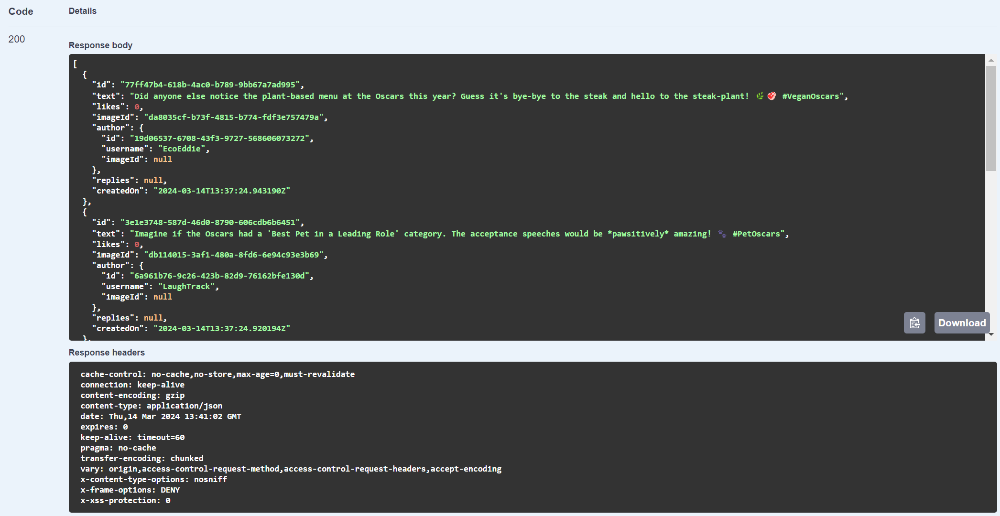

### Chirp with Replies

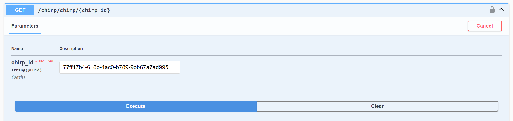

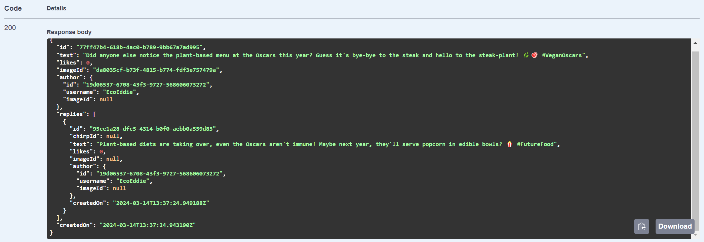

### Download Image

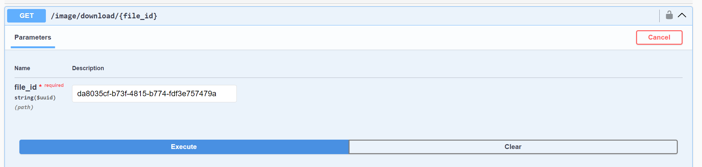

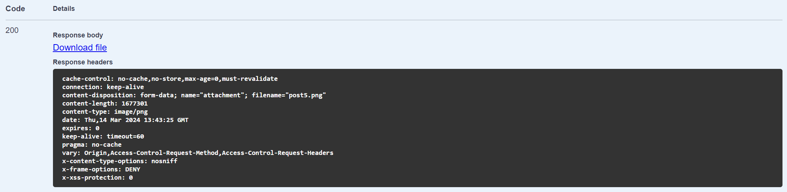

### Like Chirp

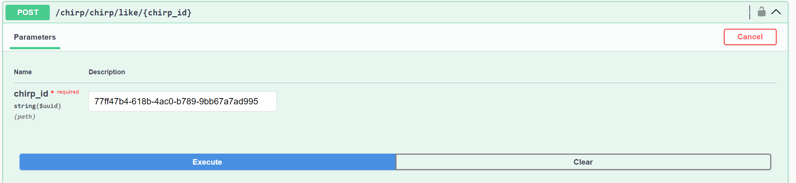

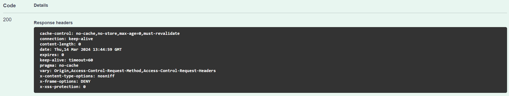

To see new likes one must query the chirp again:

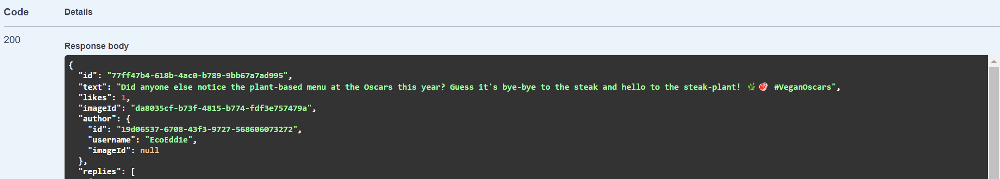

### Create Chirp

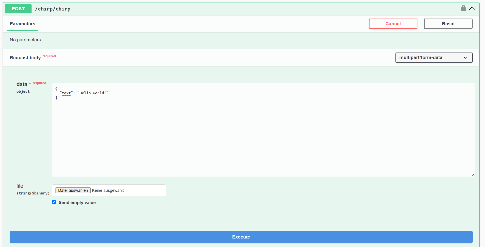

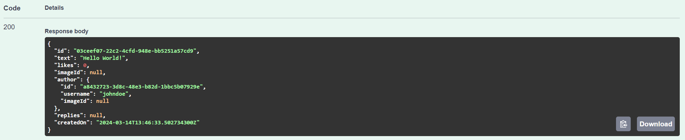