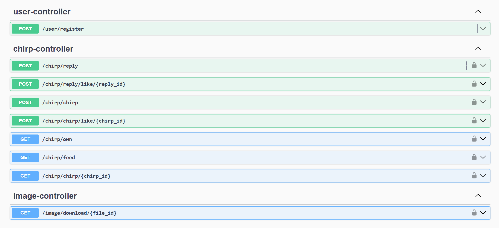
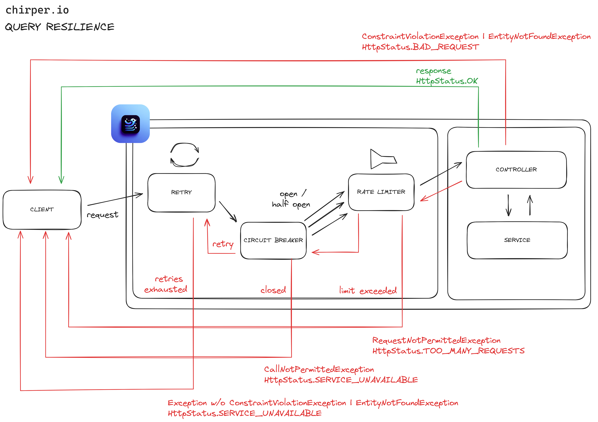
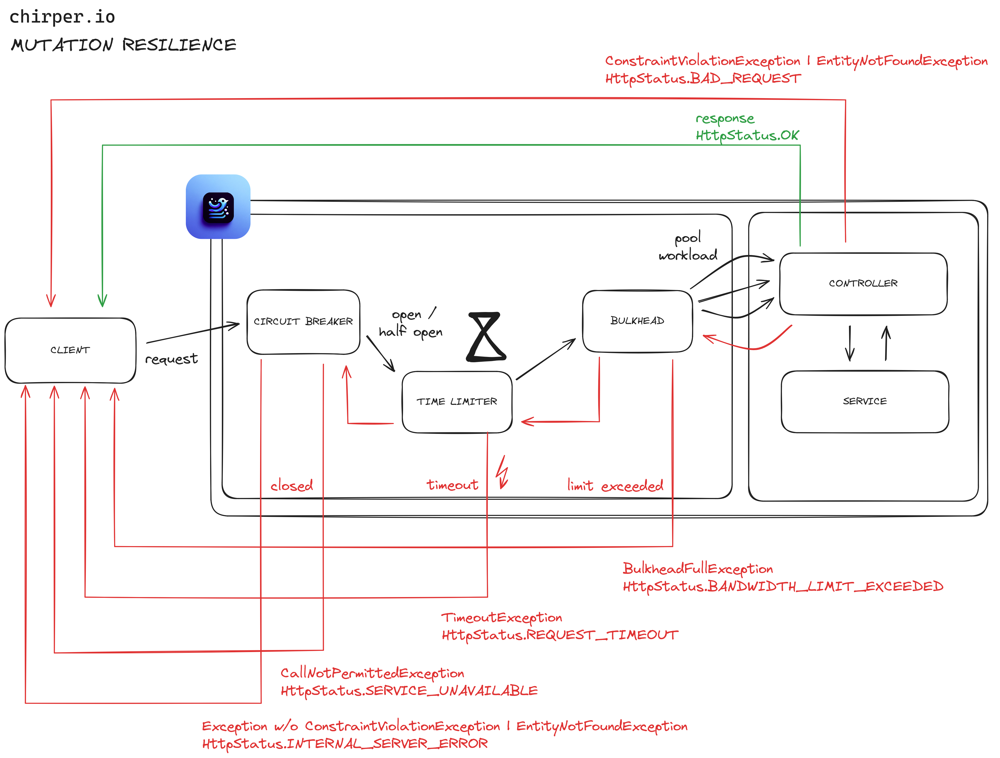
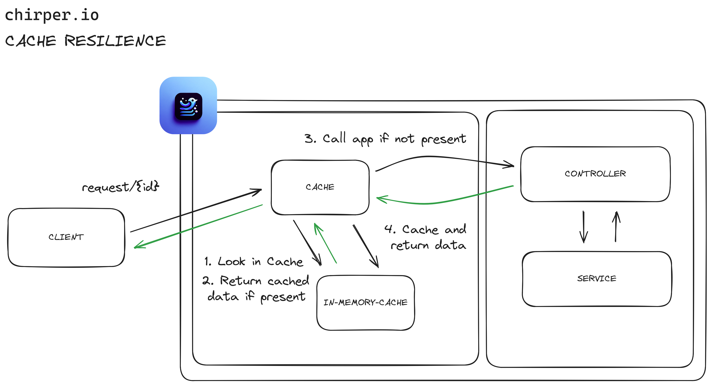

## adp-final-task

<h1 align="center">
  <br>
  </a>
  <br>
  <code>chirper.io</code> - A Resilience Exercise
  <br>
</h1>

Our decision to create `chirper.io`, a platform akin to Twitter where users can freely share their ideas and thoughts, stemmed from the recognition of the growing need for concise yet impactful social interaction mediums. As we delved into the design process, we aimed to ensure both the functionality and reliability of our application. To achieve this, we implemented various resilience patterns such as Retry, Circuit Breaker, Timeout, Rate Limiter, Bulkhead, and Cache.

> The introduction's tongue-in-cheek announcement of `chirper.io` a platform mirroring Twitter, serves as a playful critique of today's social media landscape, hinting at the echo chambers amplified by recent high-profile acquisitions. This ironic nod to the need for digital detox contrasts sharply with the serious focus on implementing resilient system design. Through strategies like Retry, Circuit Breaker, and others, the team ensures chirpers reliability, showcasing their technical skill amidst a satirical take on social media's quirks.

## 🚀 Run

```bash
cd backend
./gradlew bootRun
```

> OpenAPI Specification can be found under http://localhost:8080/swagger-ui/index.html

> Use environment `spring.profiles.active=datagen` to perform simple data generation

Test can be run via

```bash
./gradlew test
```

Resilience Tests can be run via

```
./gradlew resilienceTest
```

## 📄API



> Check out some example calls [here](./EXAMPLES.md).

## 💭 Reflection

Reflecting on the development of Chirper, our selection of resilience patterns was a calculated decision aimed at enhancing the robustness and usability of the platform. From fundamental actions such as posting and retrieving chirps to the intricate management of image content, our strategy was informed by both the challenges presented by modern social media platforms and to ensure that the system remains responsive even during periods of high traffic or resource contention.

Queries, including actions like reading the feed or fetching chirps, were fortified with Retry, Circuit Breaker, and Rate Limiter patterns. This approach was designed to enhance fault tolerance, facilitate automatic recovery from errors, and manage the flow of requests to maintain system stability.



For mutations, which encompass operations like creating chirps and liking posts or replies, we employed the Circuit Breaker, Time Limiter, and Bulkhead patterns. This combination was chosen to guard against potential failures and ensure that Chirper remains responsive and reliable, especially under high load or during service disruptions. The Circuit Breaker pattern, in particular, plays a critical role in mutations by preventing a cascade of failures from overwhelming the system.



Specifically, for image handling within chirps, we introduced a Cache mechanism. This was aimed at optimizing performance and reducing latency, thus improving the overall user experience by ensuring quick access to frequently viewed content while easing the load on backend systems. Thereby we enhance system scalability and resource utilization.



Choosing Resilience4j as our library was a deliberate decision, leveraging its comprehensive support for Spring Boot applications. This library not only facilitated the seamless integration of resilience patterns but also provided a robust framework for building a stable and efficient system.

Throughout this development journey, we faced significant challenges, particularly in fine-tuning the interplay between different resilience patterns and ensuring their effective implementation. A notable example was the complexity of managing the hierarchical application of patterns in Spring Boot via Resilience4j Annotations and its aspect ordering, which adheres to a specific order: 

```lisp
Retry ( CircuitBreaker ( Rate Limiter ( TimeLimiter ( Bulkhead ( Function ) ) ) ) )
```

This structure necessitated a deep understanding of each pattern's influence on the system's behavior.

Verifying the correct application of these patterns was another obstacle. Traditional testing methods like curl scripts fell short, prompting us to develop system tests that could accurately assess the resilience of our queries, mutations, and caching strategies.

It's crucial to note that the configurations for these patterns, like the Bulkhead's limit of only 3 concurrent calls, were set with lower thresholds for developmental purposes. This decision was aimed at better illustrating their functionality and testing their effects, although such settings are not suitable for a production environment. This limitation, along with others, was carefully chosen to ensure that our testing environment closely mimicked potential real-world scenarios, albeit at a reduced scale.

Incorporating insights from our initial design considerations, we focused on ensuring Chirper's design was not only resilient but also user-centric and scalable. The application of Resilience4j patterns was instrumental in achieving these goals, providing a solid foundation for building a platform that can withstand various stresses while maintaining a high level of user engagement.

In conclusion, the creation of Chirper was an iterative and reflective process. By strategically applying resilience patterns and continuously refining our approach based on both theoretical insights and practical challenges, we have endeavored to deliver a platform that is not only robust and reliable but also enriches the social media landscape with meaningful interactions and connections.

## Sources

* https://resilience4j.readme.io/docs/getting-started
* https://resilience4j.readme.io/docs/getting-started-3
* https://www.baeldung.com/resilience4j
* https://www.baeldung.com/spring-boot-resilience4j
* https://www.baeldung.com/spring-cache-tutorial
* https://www.baeldung.com/spring-rest-template-multipart-upload
* https://www.baeldung.com/java-db-storing-files
* https://medium.com/@aamir.zaidi5/spring-security-implementation-805520a297d5
* https://www.baeldung.com/spring-rest-openapi-documentation
* https://medium.com/garantibbva-teknoloji/applying-the-five-most-used-resiliency-patterns-using-resilience4j-with-spring-boot-1cc695988d